# Library CRUD Application — Project Report

**Name:** Bishwayan Chatterjee
**ID:** 2024EB02393
**Date:** 3rd May 2026
**Course:** Building Database Applications
**GitHub:** [https://github.com/Bish311/library-crud.git](https://github.com/Bish311/library-crud.git)

---

## 1. Introduction

This project is a Spring Boot MVC web application that manages two related entities — **Author** and **Book** — connected through a One-to-Many relationship. The application supports full Create, Read, and Update operations for both entities, demonstrates JPA relationship mapping with inner join queries, and includes comprehensive unit tests for the repository and service layers.

### Tech Stack

| Component        | Details                                      |
| ---------------- | -------------------------------------------- |
| Language         | Java 17 (OpenJDK LTS)                       |
| Framework        | Spring Boot 3.5.14                          |
| Build Tool       | Apache Maven                                |
| Packaging        | WAR                                         |
| Database         | H2 (in-memory, `jdbc:h2:mem:librarydb`)     |
| ORM              | Hibernate / Spring Data JPA                  |
| View Layer       | JSP + JSTL (under `WEB-INF/jsp/`)           |
| Styling          | Vanilla CSS (`static/css/style.css`)         |
| Testing          | JUnit 5 + Mockito                           |
| Servlet Container| Embedded Apache Tomcat                       |

---

## 2. ER Diagram

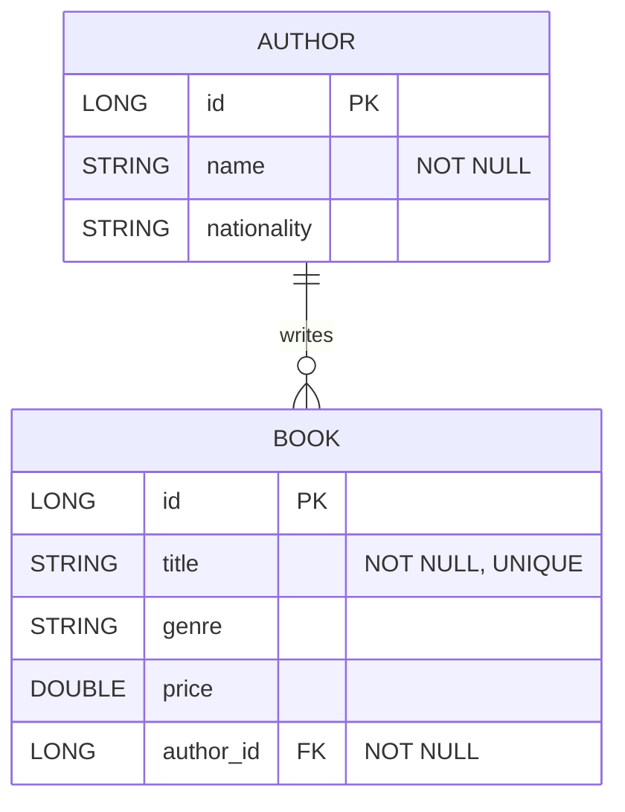

### ASCII Representation

```
┌──────────────────┐              ┌──────────────────┐
│     AUTHOR       │              │      BOOK        │
├──────────────────┤              ├──────────────────┤
│ id (PK)     LONG │──┐           │ id (PK)     LONG │
│ name      STRING │  │  1..*     │ title     STRING │
│ nationality STR  │  └─────────→ │ genre     STRING │
└──────────────────┘              │ price     DOUBLE │
                                  │ author_id (FK)   │
                                  └──────────────────┘
         Author 1 ────────── * Book
```

**Relationship:** One Author can have many Books. Each Book belongs to exactly one Author. The foreign key `author_id` in the `BOOK` table references `AUTHOR.id` and is non-nullable.

---

## 3. Project Structure

```
library-crud/
├── pom.xml
├── README.md
├── DESIGN.md
├── SUBMISSION.md
├── SUBMISSION.pdf
├── screenshots/
│   └── (Contains UI and DB documentation screenshots)
├── src/
│   ├── main/
│   │   ├── java/dev/bish/librarycrud/
│   │   │   ├── LibraryCrudApplication.java
│   │   │   ├── ServletInitializer.java
│   │   │   ├── model/
│   │   │   │   ├── Author.java
│   │   │   │   └── Book.java
│   │   │   ├── repository/
│   │   │   │   ├── AuthorRepository.java
│   │   │   │   └── BookRepository.java
│   │   │   ├── service/
│   │   │   │   ├── AuthorService.java
│   │   │   │   └── BookService.java
│   │   │   ├── controller/
│   │   │   │   ├── HomeController.java
│   │   │   │   ├── BookController.java
│   │   │   │   └── AuthorController.java
│   │   │   └── exception/
│   │   │       ├── ResourceNotFoundException.java
│   │   │       └── GlobalExceptionHandler.java
│   │   ├── resources/
│   │   │   ├── application.properties
│   │   │   ├── data.sql
│   │   │   └── static/css/style.css
│   │   └── webapp/WEB-INF/jsp/
│   │       ├── list-books.jsp
│   │       ├── add-book.jsp
│   │       ├── edit-book.jsp
│   │       ├── list-authors.jsp
│   │       ├── add-author.jsp
│   │       ├── edit-author.jsp
│   │       └── error.jsp
│   └── test/java/dev/bish/librarycrud/
│       ├── repository/BookRepositoryTest.java
│       └── service/
│           ├── BookServiceTest.java
│           └── AuthorServiceTest.java
└── .gitignore
```

---

## 4. Entity Design — Code Snippets

### 4.1 Author.java

```java
package dev.bish.librarycrud.model;

import jakarta.persistence.CascadeType;
import jakarta.persistence.Column;
import jakarta.persistence.Entity;
import jakarta.persistence.GeneratedValue;
import jakarta.persistence.GenerationType;
import jakarta.persistence.Id;
import jakarta.persistence.OneToMany;
import java.util.List;

@Entity
public class Author {

    @Id
    @GeneratedValue(strategy = GenerationType.IDENTITY)
    private Long id;

    @Column(nullable = false)
    private String name;

    private String nationality;

    @OneToMany(mappedBy = "author", cascade = CascadeType.ALL)
    private List<Book> books;

    // getters and setters omitted for brevity
}
```

### 4.2 Book.java

```java
package dev.bish.librarycrud.model;

import jakarta.persistence.Column;
import jakarta.persistence.Entity;
import jakarta.persistence.GeneratedValue;
import jakarta.persistence.GenerationType;
import jakarta.persistence.Id;
import jakarta.persistence.JoinColumn;
import jakarta.persistence.ManyToOne;

@Entity
public class Book {

    @Id
    @GeneratedValue(strategy = GenerationType.IDENTITY)
    private Long id;

    @Column(nullable = false, unique = true)
    private String title;

    private String genre;

    private Double price;

    @ManyToOne
    @JoinColumn(name = "author_id", nullable = false)
    private Author author;

    // getters and setters omitted for brevity
}
```

---

## 5. Repository Layer — Custom Query

### 5.1 BookRepository.java (Inner Join Query)

```java
@Repository
public interface BookRepository extends JpaRepository<Book, Long> {

    @Query("SELECT b.title, a.name FROM Book b INNER JOIN b.author a")
    List<Object[]> findBooksWithAuthorNames();
}
```

This JPQL query performs an **INNER JOIN** between the `Book` and `Author` entities, returning each book's title alongside its author's name. The join is navigated via the `b.author` relationship mapped by `@ManyToOne`.

### 5.2 AuthorRepository.java

```java
@Repository
public interface AuthorRepository extends JpaRepository<Author, Long> {
    boolean existsByName(String name);
}
```

---

## 6. Service Layer

### 6.1 BookService.java

```java
@Service
public class BookService {

    private final BookRepository bookRepository;

    public BookService(BookRepository bookRepository) {
        this.bookRepository = bookRepository;
    }

    // CRUD: Create operation description
    public Book save(Book book) {
        return bookRepository.save(book);
    }

    // CRUD: Update operation description
    public Book update(Long id, Book book) {
        Book existingBook = findById(id);
        existingBook.setTitle(book.getTitle());
        existingBook.setGenre(book.getGenre());
        existingBook.setPrice(book.getPrice());
        existingBook.setAuthor(book.getAuthor());
        return bookRepository.save(existingBook);
    }

    public List<Object[]> findBooksWithAuthors() {
        return bookRepository.findBooksWithAuthorNames();
    }
    
    // ... findAll and findById omitted for brevity
}
```

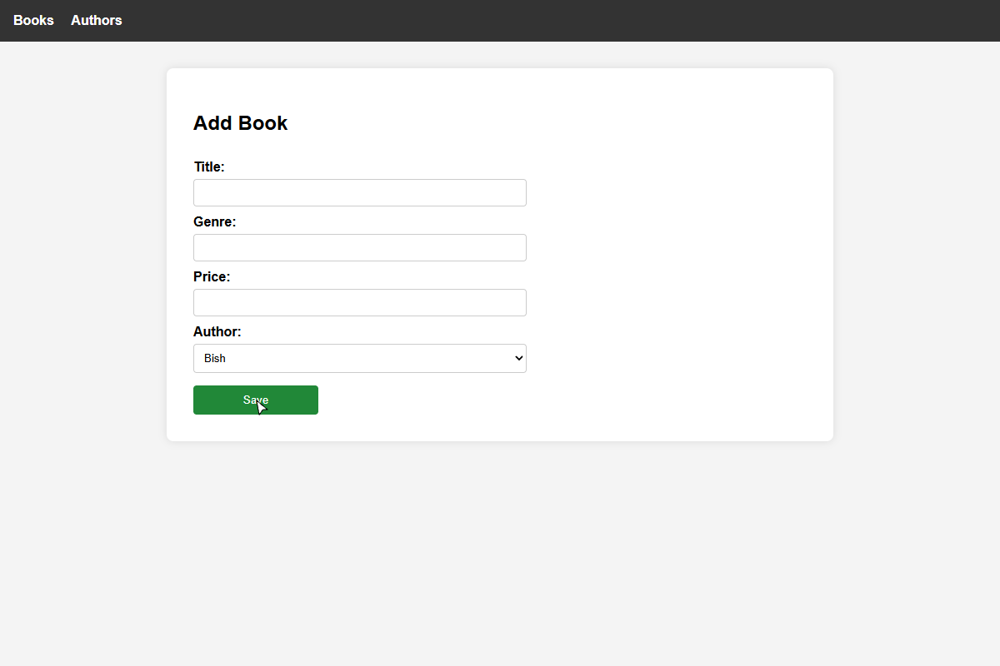

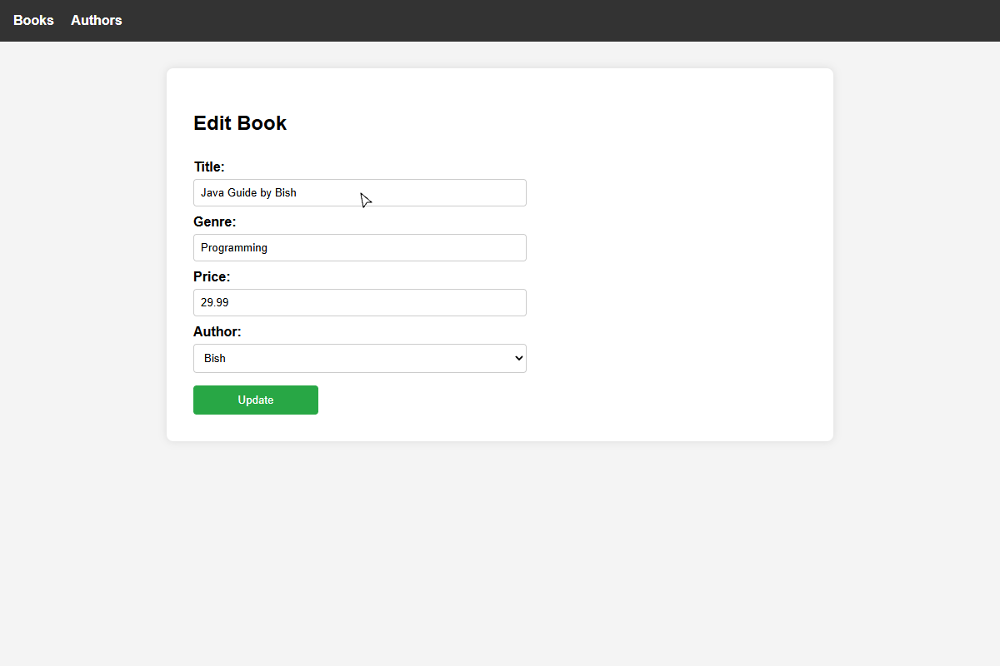

### 6.2 AuthorService.java

```java
@Service
public class AuthorService {

    private final AuthorRepository authorRepository;

    public AuthorService(AuthorRepository authorRepository) {
        this.authorRepository = authorRepository;
    }

    public Author save(Author author) {
        return authorRepository.save(author);
    }

    public Author update(Long id, Author author) {
        Author existingAuthor = findById(id);
        existingAuthor.setName(author.getName());
        existingAuthor.setNationality(author.getNationality());
        return authorRepository.save(existingAuthor);
    }
    
    // ... findAll and findById omitted for brevity
}
```

---

## 7. Controller Layer

### 7.1 BookController.java

```java
@Controller
@RequestMapping("/books")
public class BookController {

    private final BookService bookService;
    private final AuthorService authorService;

    public BookController(BookService bookService, AuthorService authorService) {
        this.bookService = bookService;
        this.authorService = authorService;
    }

    @GetMapping
    public String listBooks(Model model) {
        model.addAttribute("books", bookService.findAll());
        model.addAttribute("joinResults", bookService.findBooksWithAuthors());
        return "list-books";
    }

    @PostMapping("/add")
    public String saveBook(@ModelAttribute Book book) {
        bookService.save(book);
        return "redirect:/books";
    }

    @PostMapping("/edit/{id}")
    public String updateBook(@PathVariable Long id, @ModelAttribute Book book) {
        bookService.update(id, book);
        return "redirect:/books";
    }
    
    // ... showAddForm and showEditForm omitted for brevity
}
```

### 7.2 URL Mappings Summary

| Method | URL                  | Action                         | View              |
| ------ | -------------------- | ------------------------------ | ------------------ |
| GET    | `/`                  | Redirect to `/books`           | —                  |
| GET    | `/books`             | List all books                 | `list-books.jsp`   |
| GET    | `/books/add`         | Show add-book form             | `add-book.jsp`     |
| POST   | `/books/add`         | Save new book                  | redirect `/books`  |
| GET    | `/books/edit/{id}`   | Show pre-filled edit form      | `edit-book.jsp`    |
| POST   | `/books/edit/{id}`   | Save updated book              | redirect `/books`  |
| GET    | `/authors`           | List all authors               | `list-authors.jsp` |
| GET    | `/authors/add`       | Show add-author form           | `add-author.jsp`   |
| POST   | `/authors/add`       | Save new author                | redirect `/authors`|
| GET    | `/authors/edit/{id}` | Show pre-filled edit form      | `edit-author.jsp`  |
| POST   | `/authors/edit/{id}` | Save updated author            | redirect `/authors`|

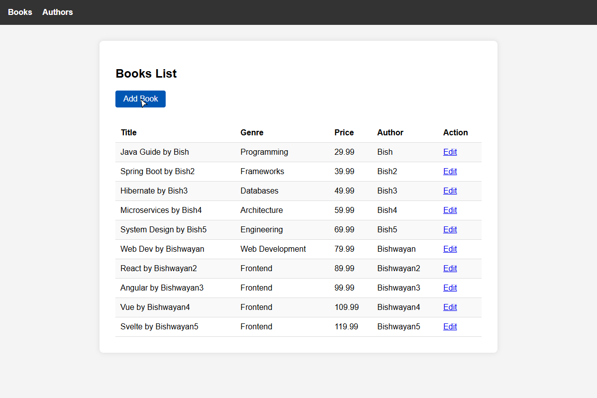
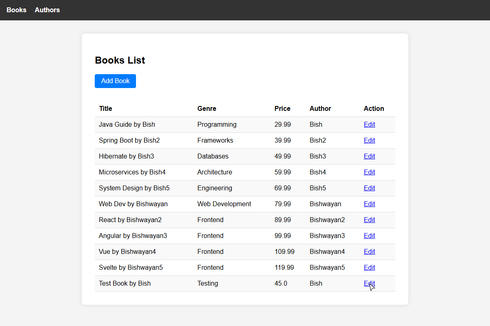
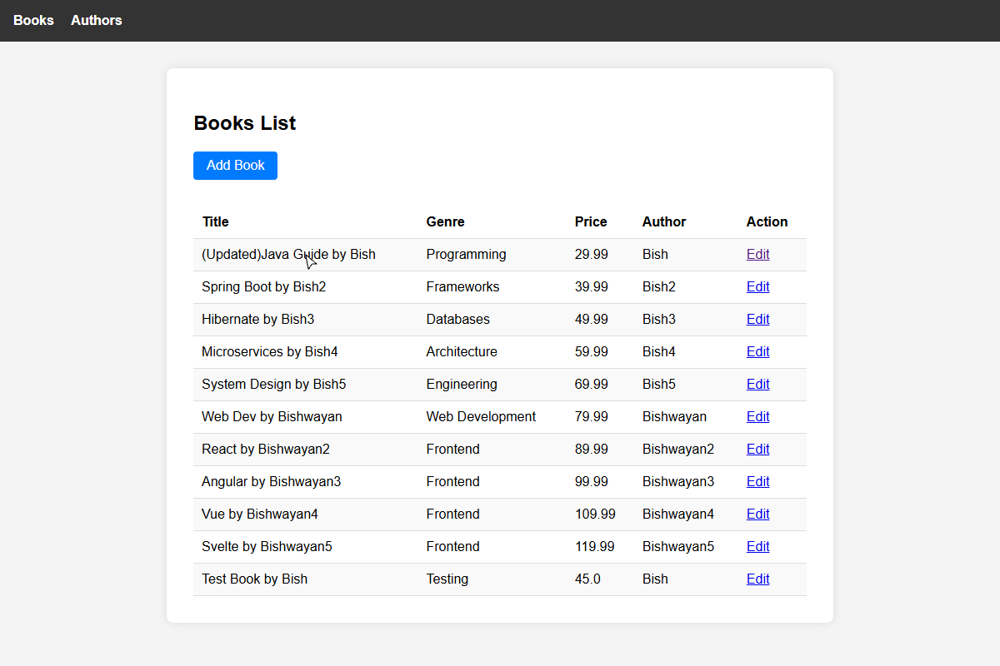

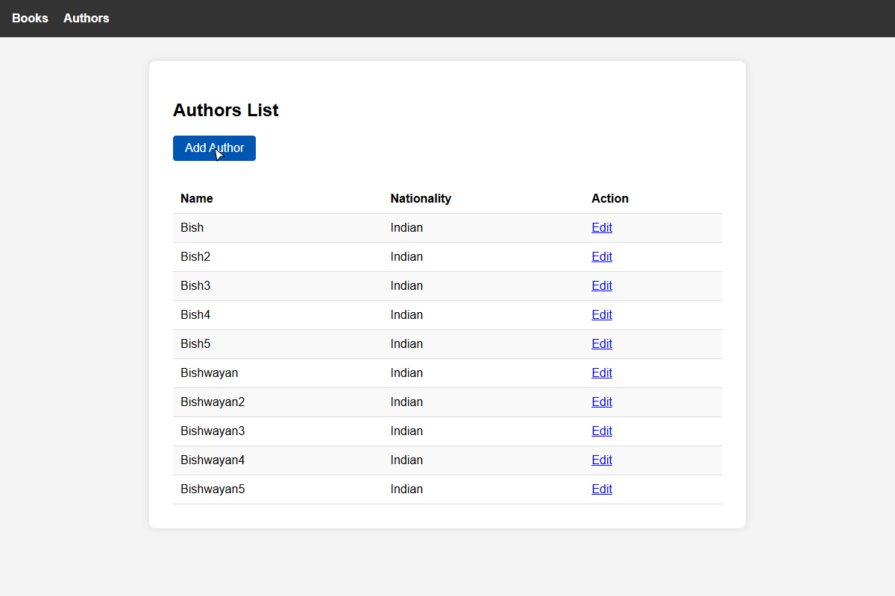
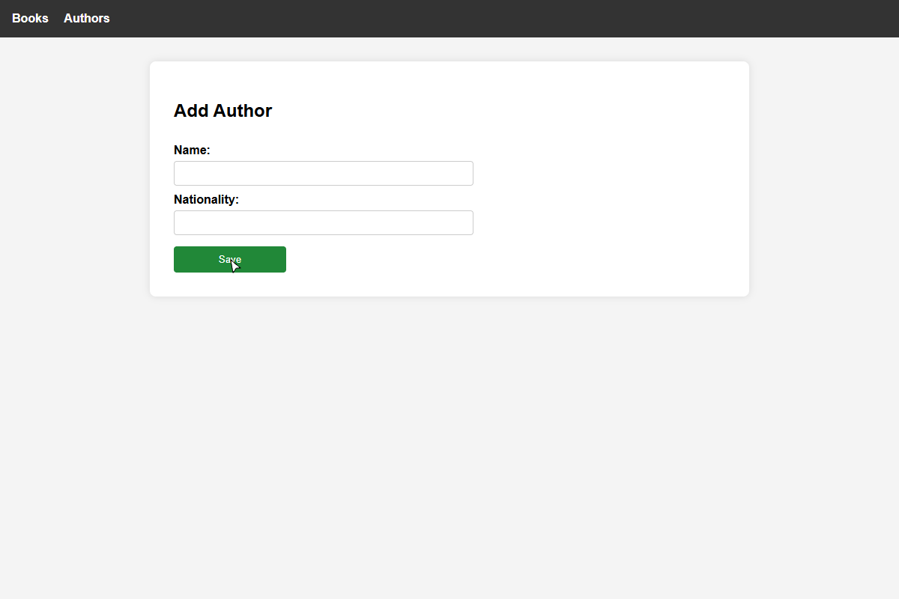

---

## 8. Exception Handling

### 8.1 ResourceNotFoundException.java

```java
public class ResourceNotFoundException extends RuntimeException {
    public ResourceNotFoundException(String message) {
        super(message);
    }
}
```

### 8.2 GlobalExceptionHandler.java

```java
@ControllerAdvice
public class GlobalExceptionHandler {

    @ExceptionHandler(ResourceNotFoundException.class)
    public String handleResourceNotFoundException(ResourceNotFoundException ex, Model model) {
        model.addAttribute("errorMessage", ex.getMessage());
        return "error";
    }

    @ExceptionHandler(DataIntegrityViolationException.class)
    public String handleDataIntegrityViolationException(DataIntegrityViolationException ex, Model model) {
        model.addAttribute("errorMessage",
            "Database error: Unable to save due to constraint violation (e.g., duplicate title).");
        return "error";
    }
}
```

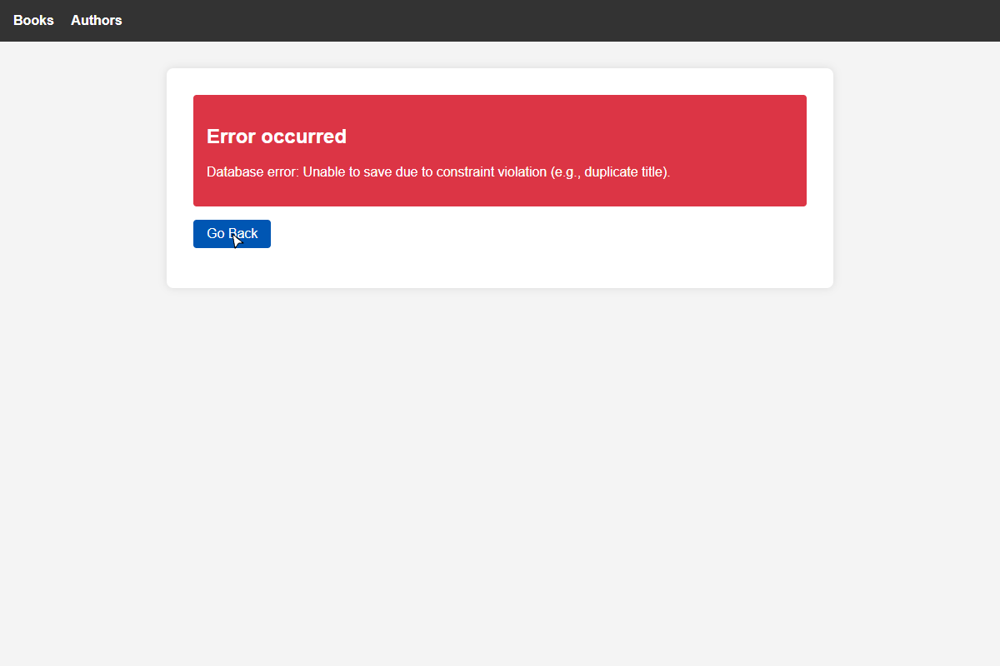

---

## 9. Database Seeding (data.sql)

```sql
INSERT INTO author (name, nationality) VALUES ('Bish', 'Indian');
INSERT INTO author (name, nationality) VALUES ('Bish2', 'Indian');
INSERT INTO author (name, nationality) VALUES ('Bish3', 'Indian');
INSERT INTO author (name, nationality) VALUES ('Bish4', 'Indian');
INSERT INTO author (name, nationality) VALUES ('Bish5', 'Indian');
INSERT INTO author (name, nationality) VALUES ('Bishwayan', 'Indian');
INSERT INTO author (name, nationality) VALUES ('Bishwayan2', 'Indian');
INSERT INTO author (name, nationality) VALUES ('Bishwayan3', 'Indian');
INSERT INTO author (name, nationality) VALUES ('Bishwayan4', 'Indian');
INSERT INTO author (name, nationality) VALUES ('Bishwayan5', 'Indian');

INSERT INTO book (title, genre, price, author_id) VALUES ('Java Guide by Bish', 'Programming', 29.99, 1);
INSERT INTO book (title, genre, price, author_id) VALUES ('Spring Boot by Bish2', 'Frameworks', 39.99, 2);
INSERT INTO book (title, genre, price, author_id) VALUES ('Hibernate by Bish3', 'Databases', 49.99, 3);
INSERT INTO book (title, genre, price, author_id) VALUES ('Microservices by Bish4', 'Architecture', 59.99, 4);
INSERT INTO book (title, genre, price, author_id) VALUES ('System Design by Bish5', 'Engineering', 69.99, 5);
INSERT INTO book (title, genre, price, author_id) VALUES ('Web Dev by Bishwayan', 'Web Development', 79.99, 6);
INSERT INTO book (title, genre, price, author_id) VALUES ('React by Bishwayan2', 'Frontend', 89.99, 7);
INSERT INTO book (title, genre, price, author_id) VALUES ('Angular by Bishwayan3', 'Frontend', 99.99, 8);
INSERT INTO book (title, genre, price, author_id) VALUES ('Vue by Bishwayan4', 'Frontend', 109.99, 9);
INSERT INTO book (title, genre, price, author_id) VALUES ('Svelte by Bishwayan5', 'Frontend', 119.99, 10);
```

**Strategy:** The property `spring.jpa.defer-datasource-initialization=true` ensures Hibernate creates the schema (`create-drop`) before Spring executes `data.sql`. Without this flag, the inserts fail because the tables do not exist yet.

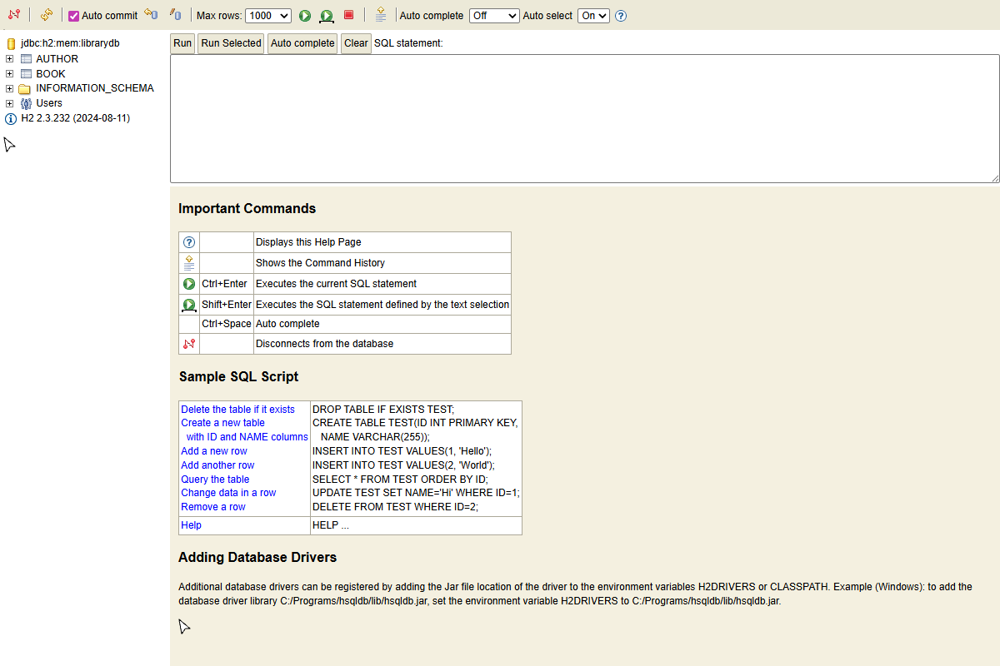

---

## 10. Application Configuration

```properties
spring.mvc.view.prefix=/WEB-INF/jsp/
spring.mvc.view.suffix=.jsp

spring.datasource.url=jdbc:h2:mem:librarydb
spring.datasource.driverClassName=org.h2.Driver
spring.jpa.hibernate.ddl-auto=create-drop
spring.jpa.defer-datasource-initialization=true
spring.sql.init.mode=always

spring.h2.console.enabled=true
```

---

## 11. JSP Views — Key Snippets

### 11.1 list-books.jsp (Book Listing with JSTL)

```jsp
<%@ taglib prefix="c" uri="http://java.sun.com/jsp/jstl/core" %>
<table>
    <tr>
        <th>Title</th>
        <th>Genre</th>
        <th>Price</th>
        <th>Author</th>
        <th>Action</th>
    </tr>
    <c:forEach var="book" items="${books}">
        <tr>
            <td>${book.title}</td>
            <td>${book.genre}</td>
            <td>${book.price}</td>
            <td>${book.author.name}</td>
            <td><a href="/books/edit/${book.id}">Edit</a></td>
        </tr>
    </c:forEach>
</table>
```

### 11.2 add-book.jsp (Author Dropdown)

```jsp
<form action="/books/add" method="POST">
    <label>Title:</label>
    <input type="text" name="title" required>

    <label>Genre:</label>
    <input type="text" name="genre" required>

    <label>Price:</label>
    <input type="number" step="0.01" name="price" required>

    <label>Author:</label>
    <select name="author.id" required>
        <c:forEach var="author" items="${authors}">
            <option value="${author.id}">${author.name}</option>
        </c:forEach>
    </select>

    <button type="submit">Save</button>
</form>
```

### 11.3 error.jsp

```jsp
<div class="error-banner">
    <h2>Error occurred</h2>
    <p>${errorMessage}</p>
</div>
<a href="/" class="btn">Go Back</a>
```

---

## 12. Unit Tests

### 12.1 BookRepositoryTest.java (`@DataJpaTest`)

```java
@DataJpaTest
public class BookRepositoryTest {

    @Autowired
    private BookRepository bookRepository;

    @Autowired
    private AuthorRepository authorRepository;

    @Test
    public void findBooksWithAuthorNamesReturnsCorrectRows() {
        Author author = new Author();
        author.setName("Bishwayan");
        author.setNationality("Indian");
        authorRepository.save(author);

        Book book = new Book();
        book.setTitle("Spring Boot by Bishwayan");
        book.setGenre("Education");
        book.setPrice(49.99);
        book.setAuthor(author);
        bookRepository.save(book);

        List<Object[]> results = bookRepository.findBooksWithAuthorNames();

        assertNotNull(results);
        assertEquals(11, results.size());

        boolean found = false;
        for (Object[] row : results) {
            if ("Spring Boot by Bishwayan".equals(row[0]) && "Bishwayan".equals(row[1])) {
                found = true;
                break;
            }
        }
        assertTrue(found);
    }

    @Test
    public void saveAndFindBookPersistsCorrectly() {
        Author author = new Author();
        author.setName("Bish");
        author.setNationality("Indian");
        authorRepository.save(author);

        Book book = new Book();
        book.setTitle("Test Java Guide by Bish");
        book.setGenre("Education");
        book.setPrice(29.99);
        book.setAuthor(author);
        Book savedBook = bookRepository.save(book);

        assertNotNull(savedBook.getId());
        assertEquals("Test Java Guide by Bish", savedBook.getTitle());

        Book retrievedBook = bookRepository.findById(savedBook.getId()).orElse(null);
        assertNotNull(retrievedBook);
        assertEquals("Test Java Guide by Bish", retrievedBook.getTitle());
    }
}
```

### 12.2 BookServiceTest.java (`@MockitoExtension`)

```java
@ExtendWith(MockitoExtension.class)
public class BookServiceTest {

    @Mock
    private BookRepository bookRepository;

    @InjectMocks
    private BookService bookService;

    @Test
    public void saveBookCallsRepository() {
        Book book = new Book();
        book.setTitle("Hibernate by Bishwayan");
        bookService.save(book);
        verify(bookRepository).save(book);
    }

    @Test
    public void findByIdThrowsWhenBookMissing() {
        when(bookRepository.findById(1L)).thenReturn(Optional.empty());
        assertThrows(ResourceNotFoundException.class, () -> {
            bookService.findById(1L);
        });
    }

    @Test
    public void updateBookSavesUpdatedFields() {
        Book existingBook = new Book();
        existingBook.setId(1L);
        existingBook.setTitle("Old Title");
        when(bookRepository.findById(1L)).thenReturn(Optional.of(existingBook));

        Book updatedBook = new Book();
        updatedBook.setTitle("New Title by Bish");
        updatedBook.setGenre("Tech");
        updatedBook.setPrice(99.99);
        bookService.update(1L, updatedBook);

        verify(bookRepository).save(existingBook);
    }
}
```

### 12.3 AuthorServiceTest.java (`@MockitoExtension`)

```java
@ExtendWith(MockitoExtension.class)
public class AuthorServiceTest {

    @Mock
    private AuthorRepository authorRepository;

    @InjectMocks
    private AuthorService authorService;

    @Test
    public void findByIdThrowsWhenAuthorMissing() {
        when(authorRepository.findById(1L)).thenReturn(Optional.empty());
        assertThrows(ResourceNotFoundException.class, () -> {
            authorService.findById(1L);
        });
    }

    @Test
    public void saveAuthorCallsRepository() {
        Author author = new Author();
        author.setName("Bishwayan");
        authorService.save(author);
        verify(authorRepository).save(author);
    }
}
```

### 12.4 Test Results

```
Tests run: 8, Failures: 0, Errors: 0, Skipped: 0

BUILD SUCCESS
```

| Test Class          | Tests | Status     |
| ------------------- | ----- | ---------- |
| BookRepositoryTest  | 2     | All Passed |
| BookServiceTest     | 3     | All Passed |
| AuthorServiceTest   | 2     | All Passed |
| ApplicationTests    | 1     | All Passed |

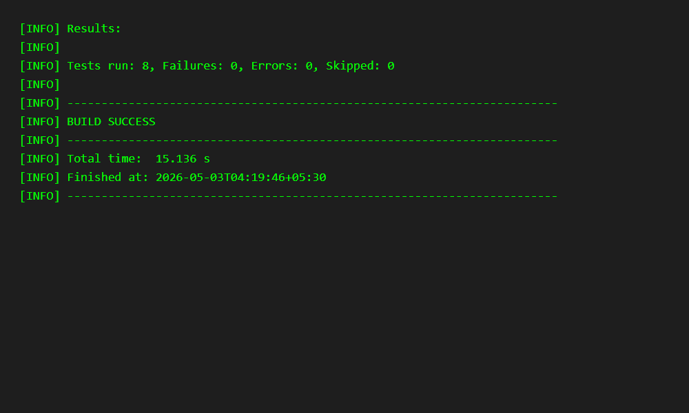

---

## 13. Challenges Encountered

### Challenge 1: Package Naming Conflict

Spring Initializr generated the base package as `dev.bish.library_crud` (with underscore), but the project spec required `dev.bish.librarycrud`. I had to rename directories under both `src/main/java` and `src/test/java`, then update every `package` declaration. Missing even one file caused `ClassNotFoundException` at startup, reinforcing the importance of verifying package consistency after any refactoring.

### Challenge 2: data.sql Clashing with @DataJpaTest

Repository tests annotated with `@DataJpaTest` still execute `data.sql` because `spring.sql.init.mode=always` is configured. This caused unique constraint violations when a test inserted a book with the same title as a seeded row. The fix was to use unique test-specific titles (e.g., "Test Java Guide by Bish") and adjust row-count assertions to account for the 10 pre-seeded records.

### Challenge 3: JSP 404 with JAR Packaging

JSP pages returned 404 errors when accidentally built as a JAR because embedded Tomcat in JAR mode cannot discover JSP files inside `WEB-INF/`. Switching to `<packaging>war</packaging>` in `pom.xml` and adding `ServletInitializer.java` (extending `SpringBootServletInitializer`) resolved the issue. This confirmed that JSP-based applications strictly require WAR packaging.

---

## 14. GitHub Repository

**Repository URL:** [https://github.com/Bish311/library-crud.git](https://github.com/Bish311/library-crud.git)

To clone and run:

```bash
git clone https://github.com/Bish311/library-crud.git
cd library-crud
./mvnw spring-boot:run
```

Open browser at `http://localhost:8080` to use the application.

---

## 15. UI Screenshots Gallery

### 1. Book List Page


### 2. Add Book Form


### 3. Books After Add


### 4. Edit Book Form


### 5. Books After Update


### 6. Author List Page


### 7. Add Author Form


### 8. H2 Console Data


### 9. Error Page (Duplicate)


### 10. Tests Passing


